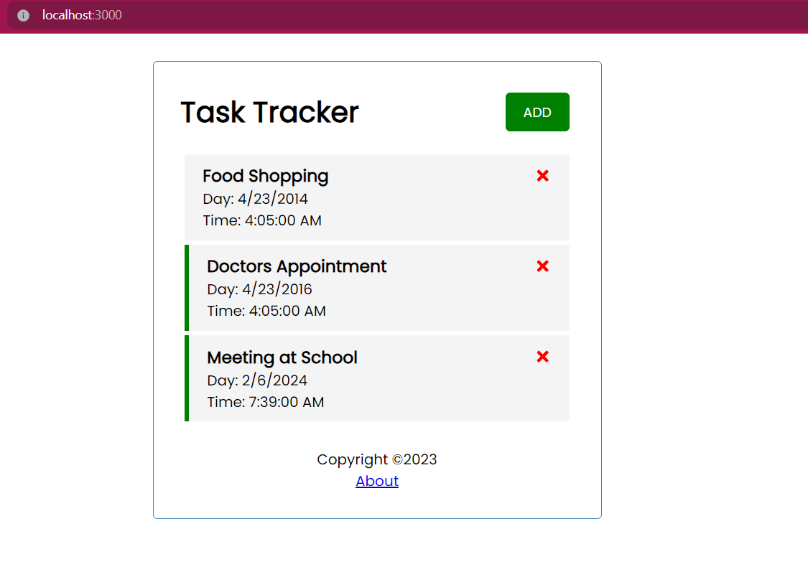
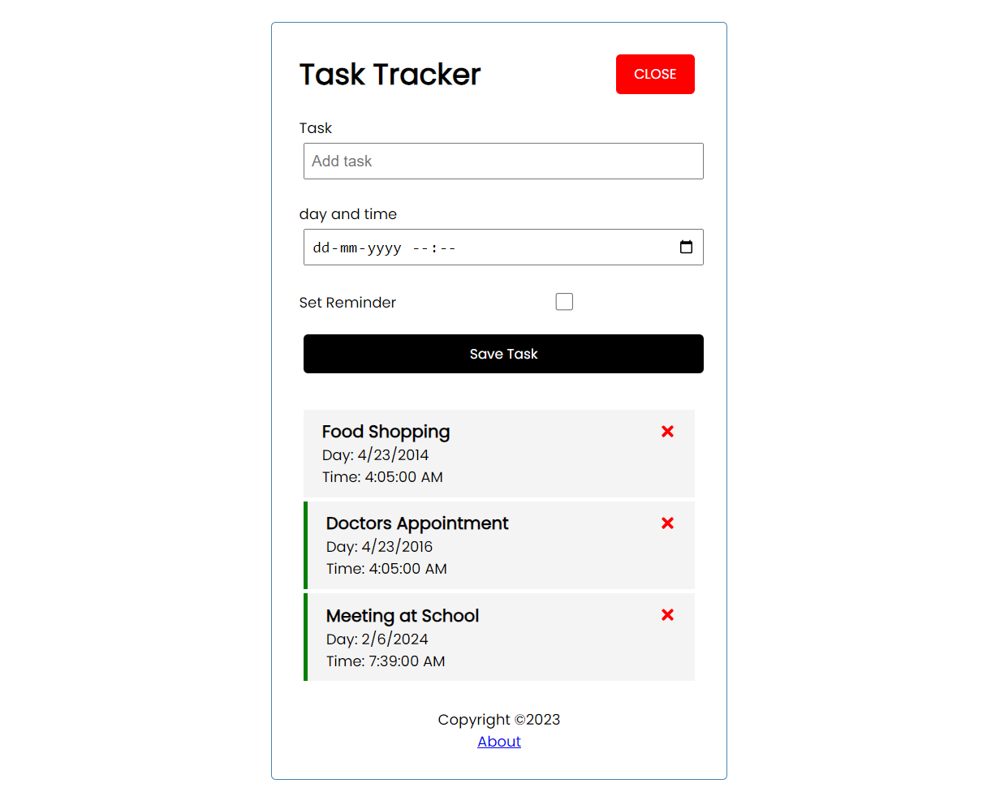

# FAKE API

## Json Server

<!--  -->
<!--  -->

    
    

JSON Server is an easy and quick-to-set-up module that you can use to fake or mock an API. You can find the basics in the documentation, and many articles regurgitate the same info. In this post, though, I intend to cover a few of the more complex things you can do with JSON Server.

> > ---

        - npm install -g serve // global
        - serve -s build
        - serve -s build -p8000

        - Powershell Command:
        - Set-ExecutionPolicy RemoteSigned -Scope CurrentUser

        - "server":"json-server --watch db.json --port 5000"
        - json-server db.json --port 5000

        - npm i react-router-dom

https://spin.atomicobject.com/api-json-server/

---

React is a library for building user interface

it runs on the client as SPA(single page app),but can be used to build stack apps by communicating with a server(eg.MERN stack)

react is often referred to as a front-end "framework" because it is capable and directly comparable to a framwork such as Angular or vue.

> uses---

        structure the "view" layer of your application
        reusable components with their own state
        JSX - dynamic markup
        interactive UIs with virtual DOM
        performance & testing
        very popular in the industry
