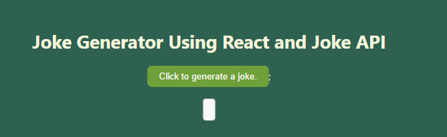
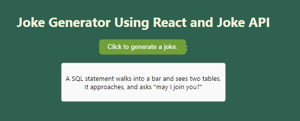

# Preview

# Joke Generator React App

This is a simple React application that fetches random jokes from the JokeAPI and displays them on the webpage.

# Features

Fetches random jokes from the JokeAPI.
Allows users to select different joke categories such as general, programming, pun, etc.
Refreshes the joke display with a new random joke upon user request.

# Technologies Used

React.js: A JavaScript library for building user interfaces.
Axios: A promise-based HTTP client for making API requests.
JokeAPI: An API that provides random jokes in various categories.

# AJAX and API

APIs are used for fetching data from the server and using AJAX and API we call data asynchronously and show it in our HTML. You can make API requests by using browser build in fetch function or third party libraries like Axios. You can make API requests anywhere but it is totally recommended that you should make an API call in componentDidMount() life cycle method.

Reasons to use componentDidMount(): So, this can be really simple by just putting the API request in componentDidMount.

Using componentDidMount makes sure that data won’t be loaded until after the initial render which is really important.
Using componentDidMount make sure that the data is only fetched from client.
