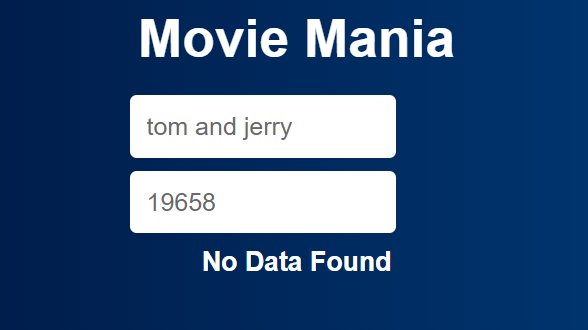

# Axios

Axios is a promise-based HTTP Client for node.js and the browser. It is isomorphic (= it can run in the browser and nodejs with the same codebase). On the server-side it uses the native node.js http module, while on the client (browser) it uses XMLHttpRequests.

## Example :

`// Make a GET request to a URL
axios.get('https://api.example.com/data')
  .then(response => {
    // Handle successful response
    console.log(response.data);
  })
  .catch(error => {
    // Handle error
    console.error('Error:', error);
  });
`

# Preview

