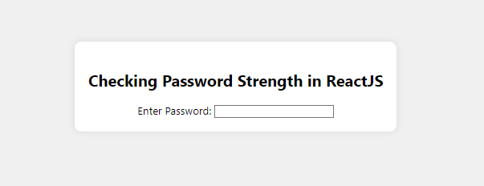
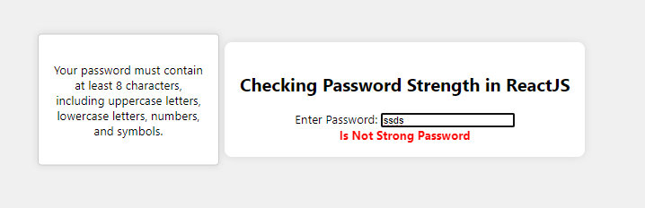
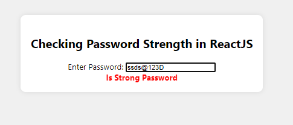

# Preview

# validator

The Validator module is popular for validation. Validation is necessary to check whether the data is correct or not, so this module is easy to use and validates data quickly and easily.

const validator = require('validator')

// Check whether given email is valid or not
let email = 'test@gmail.com'
console.log(validator.isEmail(email)) // true
email = 'test@'
console.log(validator.isEmail(email)) // false

# React useState Hook

The useState hook is a powerful addition to React, introduced in version 16.8. It allows you to manage state within functional components without the need for class-based components.

import React, { useState } from 'react';

function App() {
const [click, setClick] = useState(0);
// using array destructuring here
// to assign initial value 0
// to click and a reference to the function
// that updates click to setClick
return (

You clicked {click} times

            <button onClick={() => setClick(click + 1)}>
                Click me
            </button>
        

    );

}

export default App;
